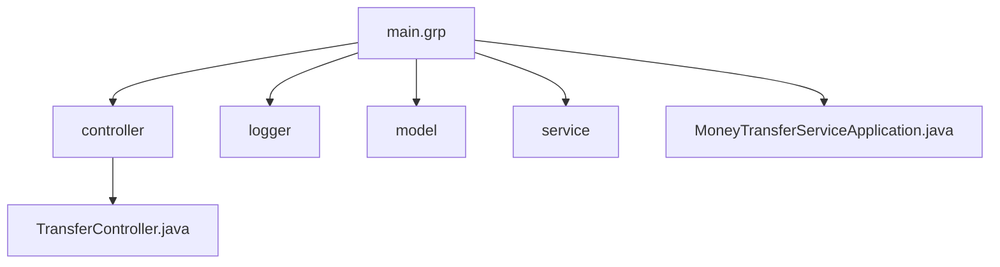

# Курсовой проект "Сервис перевода денег"

Сервис представляет собой приложение — REST-сервис. Задача: предоставить интерфейс для перевода денег с одной карты на другую по заранее описанной спецификации.
Спецификация предоставлена по данному адресу [по данному адресу](https://github.com/netology-code/jd-homeworks/blob/master/diploma/MoneyTransferServiceSpecification.yaml)

Работает на порту 5500, для обеспечения взаимодействия с [FRONT](https://serp-ya.github.io/card-transfer)

Операции записываются в log.

## Примеры запросов
Создание перевода
/transfer
```
{
    "cardFromNumber": "1234567812345678",
    "cardFromValidTill": "12/26",
    "cardFromCVV": "123",
    "cardToNumber": "8765432187654321",
    "amount": {
      "currency": "RUB",
      "value": 1000.00
    }
  }
```

ответ представляет собой JSON
c указанным ID перевода
```
{"operationId":"430777d1-5ce6-4175-afd2-9274951fe68a"}
```
Который необходимо подтвердить
/confirmOperation
```
{
    "operationId": "430777d1-5ce6-4175-afd2-9274951fe68a",
    "code": "0000"
}
```
Отработка сервиса в WEB форме

Операция прошла


# Схема проекта


